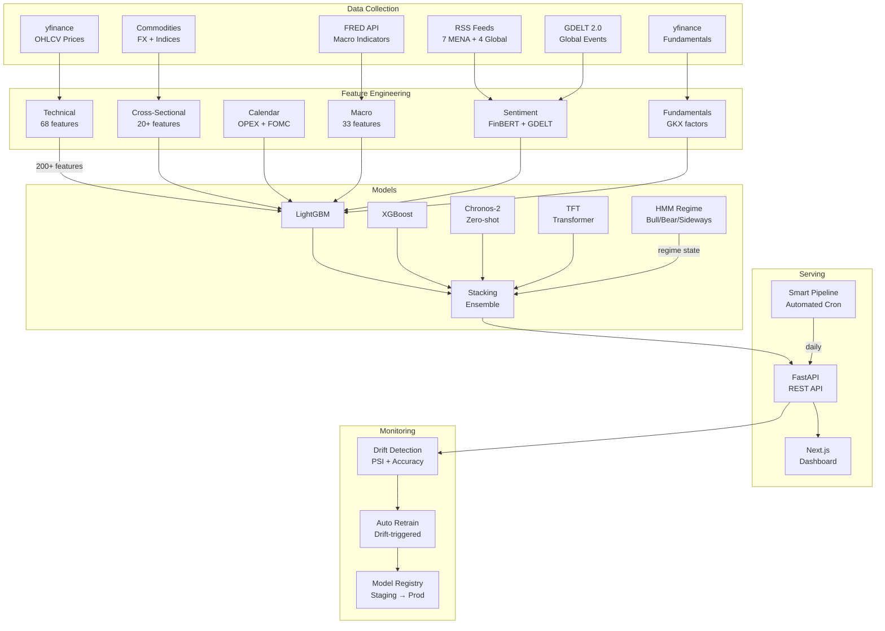
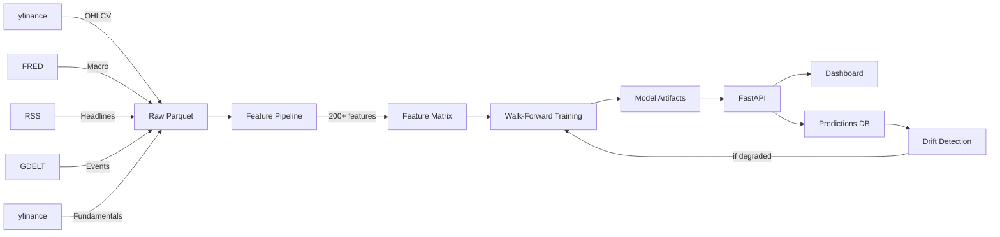

<p align="center">
  <h1 align="center">StockVision AI</h1>
  <p align="center">
    ML-powered stock price direction forecasting across US & MENA markets
    <br />
    <em>53%+ directional accuracy | Walk-forward validated | Sharia-compliant screening</em>
  </p>
</p>

<p align="center">
  
  
  
  
  
  
</p>

---

## Overview

StockVision AI predicts stock price direction (up / flat / down) at **1-day, 5-day, and 20-day** horizons using an ensemble of classical ML, foundation models, and deep learning — informed by 200+ engineered features from technical indicators, macroeconomic data, news sentiment, and market regime detection.

**Markets covered:** US (21 tickers), Egypt EGX (12), Saudi Tadawul (10), UAE (6), Qatar (3), Kuwait (1) + regional ETFs

---

## Architecture



---

## Project Structure

```
stock-ml-pipeline/
│
├── configs/                          # Single source of truth
│   ├── data_config.yaml              #   Data pipeline + validation settings
│   ├── model_config.yaml             #   All model hyperparameters
│   └── tickers.yaml                  #   51 tickers + MENA + Sharia + GDELT keywords
│
├── src/
│   ├── collectors/                   # 7 data collectors
│   │   ├── price_collector.py        #   yfinance OHLCV (2000–today)
│   │   ├── macro_collector.py        #   FRED ALFRED vintage data
│   │   ├── news_collector.py         #   11 RSS feeds (4 global + 7 MENA)
│   │   ├── gdelt_collector.py        #   GDELT 2.0 global events + tone
│   │   ├── events_collector.py       #   Commodity, FX, regional indices
│   │   ├── fundamentals_collector.py #   Market cap, P/B, ROE, Sharia screening
│   │   └── historical_news_collector.py  # FNSPID 15.7M records backfill
│   │
│   ├── features/                     # 10 feature engineering modules
│   │   ├── pipeline.py               #   Orchestrator + data cleaning
│   │   ├── technical.py              #   68 indicators (momentum, vol, microstructure)
│   │   ├── cross_sectional.py        #   Breadth, lead-lag, sector momentum
│   │   ├── calendar.py               #   OPEX, FOMC, quarter-end, holidays
│   │   ├── macro.py                  #   Yield curve, CPI, Sahm rule
│   │   ├── sentiment.py              #   Modern-FinBERT-large scorer
│   │   ├── sentiment_llm.py          #   vLLM rich analysis (optional)
│   │   ├── sentiment_features.py     #   Daily aggregation + disagreement
│   │   ├── targets.py                #   Adaptive volatility-based labels
│   │   └── normalizer.py             #   Percentile rank + SHAP selection
│   │
│   ├── models/                       # 5 model types
│   │   ├── baseline.py               #   XGBoost + LightGBM (regularized)
│   │   ├── foundation.py             #   Chronos-2 + Moirai 2.0 (zero-shot)
│   │   ├── tft.py                    #   Temporal Fusion Transformer
│   │   ├── ensemble.py               #   Stacking meta-learner
│   │   └── regime.py                 #   3-state HMM (bull/bear/sideways)
│   │
│   ├── training/                     # Training + evaluation + MLOps
│   │   ├── walk_forward.py           #   Expanding/sliding window validation
│   │   ├── train.py                  #   Walk-forward training loop
│   │   ├── train_tft.py              #   TFT training with PyTorch Lightning
│   │   ├── train_foundation.py       #   Foundation model evaluation
│   │   ├── evaluate.py               #   Accuracy, Sharpe, F1, drawdown
│   │   ├── drift.py                  #   Performance + data + regime drift
│   │   ├── registry.py               #   Model versioning (staging → prod)
│   │   ├── retrain.py                #   Automated retraining pipeline
│   │   └── tft_data.py               #   TFT data preparation
│   │
│   ├── inference/                    # Prediction serving
│   │   ├── api.py                    #   FastAPI REST endpoints
│   │   ├── predictor.py              #   Model loading + prediction
│   │   └── logger.py                 #   Prediction logging + actuals backfill
│   │
│   └── utils/
│       ├── config.py                 #   Central YAML config loader
│       ├── db.py                     #   PostgreSQL/TimescaleDB helpers
│       └── logger.py                 #   Rich structured logging
│
├── dashboard/                        # Next.js 15 + shadcn/ui
│   └── src/
│       ├── app/                      #   4 pages (Overview, Models, Sentiment, Pipeline)
│       ├── components/               #   TradingView candlestick chart
│       └── lib/                      #   API client + utilities
│
├── scripts/
│   ├── setup.sh                      #   One-command first-time setup
│   ├── smart_pipeline.sh             #   Full automated pipeline (cron-ready)
│   ├── bootstrap_db.sql              #   TimescaleDB schema (7 tables)
│   ├── backfill_history.sh           #   Historical data backfill
│   └── daily_update.sh               #   Daily price + news update
│
├── data/{raw,processed,splits}/      #   Data directories (gitignored)
├── models/                           #   Model artifacts (gitignored)
├── logs/                             #   Pipeline logs
│
├── Dockerfile                        #   API image (multi-stage, ~600MB)
├── Dockerfile.worker                 #   Worker image (~650MB)
├── docker-compose.yml                #   Full stack orchestration
├── Makefile                          #   40+ commands
├── pyproject.toml                    #   Python 3.12 deps (CPU/GPU optional)
├── SPEC.md                           #   Technical specification
└── GETTING_STARTED.md                #   Step-by-step setup guide
```

---

## Key Features

| Category | Details |
|----------|---------|
| **Markets** | US (21), Egypt EGX (12), Saudi Tadawul (10), UAE (6), Qatar (3), Kuwait (1) |
| **Features** | 200+ per ticker: technical, macro, sentiment, cross-sectional, calendar, fundamentals |
| **Models** | XGBoost, LightGBM, HMM Regime, Chronos-2, TFT, Stacking Ensemble |
| **Validation** | Walk-forward with 21-day purged embargo (no data leakage) |
| **Accuracy** | 53%+ directional accuracy, positive Sharpe across all horizons |
| **Sentiment** | Modern-FinBERT-large + GDELT tone + 11 RSS feeds (4 global + 7 MENA) |
| **Sharia** | AAOIFI-compliant screening (debt < 33%, no prohibited sectors) |
| **Automation** | Cron-based smart pipeline: collect → score → build → drift-check → retrain |
| **Dashboard** | Next.js 15 with TradingView candlestick charts, region filter, model comparison |
| **Docker** | Multi-stage builds, ~1.8GB total, resource-limited containers |

---

## Quickstart

```bash
# 1. Clone
git clone git@github.com:yahia-borg/stock-ml-pipeline.git
cd stock-ml-pipeline

# 2. Setup (creates venv, installs deps, starts DB)
bash scripts/setup.sh

# 3. Activate
source .venv/bin/activate

# 4. Backfill price data (no API key needed)
make backfill-quick

# 5. Build features + train models
make features
make train-baseline

# 6. Start API + Dashboard
make run              # Terminal 1: API on :8099
make dashboard        # Terminal 2: Dashboard on :3000
```

See [GETTING_STARTED.md](GETTING_STARTED.md) for the full step-by-step guide.

---

## Commands

```bash
# Setup
make setup              # First-time setup (CPU)
make setup-gpu          # First-time setup (GPU)

# Data
make backfill           # Full historical backfill (2000–today)
make daily-update       # Daily price + news update
make collect-news       # RSS feeds (global + MENA)
make collect-gdelt      # GDELT global events
make collect-events     # Commodity, FX, regional signals
make collect-fundamentals  # Company financials + Sharia screening

# Features
make features           # Build full feature matrix
make score-sentiment    # Score headlines with FinBERT

# Training
make train-baseline     # Train XGBoost + LightGBM (all horizons)
make train-regime       # Fit HMM regime detector
make eval-chronos       # Evaluate Chronos-2 zero-shot
make train-tft          # Train Temporal Fusion Transformer
make compare-models     # Side-by-side model comparison

# Monitoring
make monitor            # Full drift check
make retrain            # Retrain if drift detected
make retrain-force      # Force retrain all models

# Automation
make smart-pipeline     # Run full automated pipeline
make smart-pipeline-retrain  # Pipeline + forced retrain

# Docker
make docker-build       # Build all images
make docker-up          # Start full stack
make docker-down        # Stop all containers

# Dashboard
make dashboard-install  # Install npm deps (first time)
make dashboard          # Start dev server on :3000
```

---

## Model Performance

Results from walk-forward validation (93 quarterly folds, 2003–2026):

| Model | Horizon | Dir Accuracy | Sharpe | Win Rate |
|-------|---------|-------------|--------|----------|
| XGBoost | 1d | **53.2%** | 0.34 | 52.5% |
| LightGBM | 1d | 52.4% | **0.45** | 51.8% |
| XGBoost | 5d | 52.6% | 0.13 | 52.3% |
| XGBoost | 20d | 52.8% | 0.10 | 52.4% |
| LightGBM | 20d | 51.9% | 0.06 | 51.7% |

> 53% directional accuracy is statistically significant. Academic papers with honest walk-forward validation typically achieve 51–58% (Gu, Kelly & Xiu, 2020).

---

## Data Pipeline



---

## Tech Stack

| Layer | Technology |
|-------|-----------|
| **Language** | Python 3.12 |
| **ML** | XGBoost, LightGBM, PyTorch, HMMLearn |
| **Foundation Models** | Amazon Chronos-2, Salesforce Moirai 2.0 |
| **NLP** | Modern-FinBERT-large, vLLM (optional) |
| **Database** | PostgreSQL 16 + TimescaleDB |
| **API** | FastAPI + Uvicorn |
| **Frontend** | Next.js 15, TradingView Lightweight Charts, Recharts |
| **Infrastructure** | Docker Compose, Make, cron |
| **MLOps** | W&B, MLflow, Evidently (drift) |

---

## Configuration

All settings live in three YAML files:

- **`configs/tickers.yaml`** — Ticker universe, macro indicators, GDELT keywords, Sharia compliance
- **`configs/data_config.yaml`** — Data pipeline, validation, feature engineering, news sources
- **`configs/model_config.yaml`** — Model hyperparameters, training, evaluation, monitoring

No hard-coded magic numbers in source code.

---

## Contributing

```bash
source .venv/bin/activate
make lint-fix           # Auto-fix code style
make test               # Run tests
```

---

## License

MIT

---

<p align="center">
  Built with Python, PyTorch, FastAPI, and Next.js
</p>
